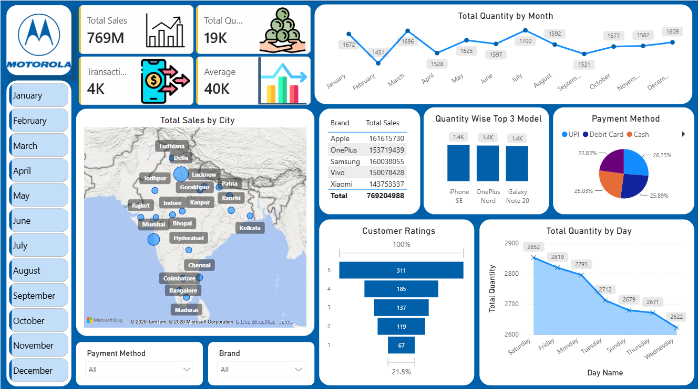

# 📱 Mobile Sales Dashboard - Power BI

## 📌 Project Overview
This project presents an interactive Power BI dashboard built to analyze mobile phone sales across different cities, brands, months, and payment methods. The dashboard helps identify sales trends, customer preferences, and business performance using interactive visualizations.

---

## 📊 Dashboard Preview

> Add a screenshot of your dashboard here.



---

## 🎯 Objectives

- Analyze overall mobile sales performance.
- Track monthly sales and quantity trends.
- Compare sales across different mobile brands.
- Identify top-performing cities and products.
- Analyze customer ratings and payment methods.
- Enable interactive business analysis using slicers and filters.

---

## 🛠️ Tools & Technologies

- Power BI Desktop
- Power Query
- DAX
- Microsoft Excel
- Data Visualization

---

## 📈 Dashboard Features

- KPI Cards
  - Total Sales
  - Total Transactions
  - Total Quantity Sold
  - Average Sales

- Interactive Slicers
  - Month
  - Brand
  - Payment Method

- Visualizations
  - Map
  - Line Chart
  - Bar Chart
  - Pie Chart
  - Funnel Chart
  - Table

---

## 🔍 Key Insights

- Monthly sales trend analysis
- Top-performing brands
- City-wise sales distribution
- Customer rating analysis
- Payment method distribution
- Product-wise quantity analysis

---

## 📂 Repository Structure

```
Mobile-Sales-Dashboard/
│
├── Mobile_sales_dashboard.pbix
├── Mobile_Sales_Data.xlsx
├── Dashboard.png
└── README.md
```

---

## 🚀 Skills Demonstrated

- Data Cleaning (Power Query)
- Data Modeling
- DAX Measures
- Dashboard Design
- Business Intelligence
- Data Visualization
- Interactive Reporting

---

## 👤 Author

**Sona Unni U**
